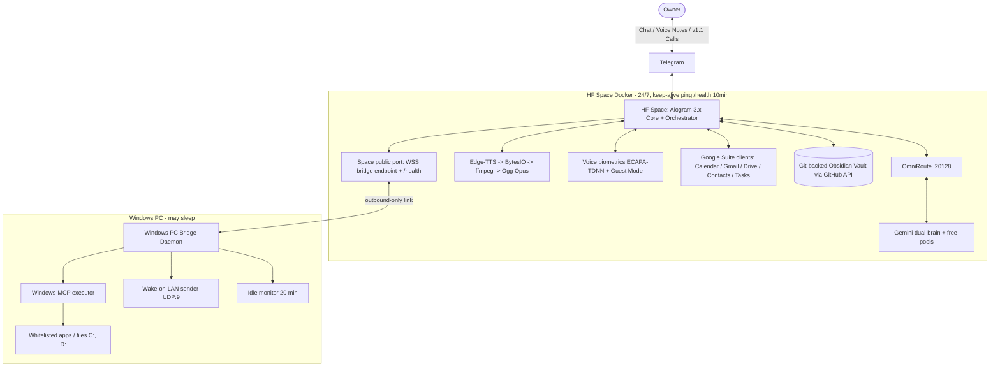

# 01 — System Architecture

## 1. Confirmed Mission Record (Discovery, 2026-08-26)

- **Project**: Vantrilex Assistant OS — Universal Agentic OS v1.1.0, persona **Sara (سارة)**.
- **Rulings**: Sara naming (Q1) · VPS-primary topology (Q2 — **superseded by ADR-15: HF
  Spaces runtime host, 2026-08-29**) · owner-only access (Q3) ·
  v1.0 = exec core minus live calls (Q4) · $0.00 absolute + Telegram confirmation fallback
  for whitelist misses (Q5) · credential manifest filled progressively (Q6).
- **OmniRoute gateway**: `http://localhost:20128/v1`, co-located with the core on the VPS;
  aggregates 90+ free provider pools (DeepSeek V3/R1, Gemini Flash, Groq Llama 3.3) with
  quota-aware auto-fallback. Adapter: `src/gateway.py` (`OmniRouteClient`) — the only module
  speaking LLM wire format; SSE streaming, PRIMARY->FAST model fallback, quota/transient/fatal
  classification; consumers get plain text deltas or `GatewayError`.
- **Telegram voice/chat architecture**: Aiogram 3.x long-polling Markdown chat; Edge-TTS
  (`ar-JO-SanaNeural`) streamed in-memory via `io.BytesIO`, transcoded by ffmpeg to native
  Ogg Opus voice bubbles (<600 ms first-chunk target); live bidirectional calls via PyTgCalls
  arrive in v1.1.
- **Validated deployment path (ADR-15, 2026-08-29)**: free-tier **Hugging Face Spaces** hosts
  ONE Docker Space co-locating core + OmniRoute + Edge-TTS (single public port = WSS bridge
  endpoint + `/health`; HF Secrets; keep-alive cron ping every 10 min); the Space's filesystem is
  disposable — all durable state lives in the git-backed vault; **Windows PC Bridge daemon**
  connects outbound-only (TLS WebSocket, zero inbound ports) executing WoL + Windows-MCP tasks.
  PC may sleep; Sara stays up.

## 2. Component Topology



## 3. Audio Pipeline (voice notes)

1. Response text finalized by the orchestrator.
2. `edge-tts` streams `ar-JO-SanaNeural` audio chunks into `io.BytesIO` (no disk writes).
3. ffmpeg (`subprocess` under an executor) transcodes PCM/MP3 chunks -> Ogg Opus
   (48 kHz, 20 ms frames) as a stream, emitting the first chunk before full encode.
4. First chunk is dispatched to Telegram immediately (<600 ms target); remainder follows.
5. Dialect notes (`Dialect_Notes.md`) tune pronunciation/colloquialism over time.

## 4. Tiered Email Triage Matrix

| Tier | Detection | v1.0 Action | v1.1 Action |
|---|---|---|---|
| Low / Spam | Classifier score low | Drop & ignore | Drop & ignore |
| Semi-important | Medium score | Structured Telegram Markdown text | Same |
| Important / review needed | High score | Edge-TTS voice note | Voice note |
| Critical / urgent / VIP | VIP sender or urgency keywords | Priority voice note + repeat ping until acknowledged | **Immediate PyTgCalls outbound call** |

Classifier input is untrusted data: parsed email bodies can never trigger PC actions.
Before any LLM classification the body is compacted (M7, TokenJuice pattern): signatures,
disclaimers, tracking boilerplate and quoted chains are stripped and the body is capped to
the classification budget — cutting free-pool token burn without changing tier decisions.

## 5. Whitelist Guardrail (PC control)

```json
{
  "allowed_apps": [
    {"name": "calculator", "executable": "calc.exe", "auto_approve": true},
    {"name": "obsidian", "executable": "Obsidian.exe", "auto_approve": true}
  ],
  "restricted_actions": [
    {"action": "shutdown", "requires_confirmation": true},
    {"action": "restart", "requires_confirmation": true},
    {"action": "sleep", "requires_confirmation": true}
  ]
}
```

Flow: request -> lookup in `config/whitelist.json` -> whitelisted => execute via
Windows-MCP and notify -> NOT whitelisted => confirmation prompt on Telegram
(v1.0 text/voice note; v1.1 live call: "هاد البرنامج مش بالقائمة المعتمدة، هل
بتأكدلي صراحة؟") => explicit approval recorded (confirmation ID persisted to vault)
=> execute. Idle >20 min => Sara offers shutdown/sleep by message.

## 6. Knowledge Vault Layout (PARA + Zettelkasten)

```
01_Projects/   03_Resources/   04_Archives/
02_Areas/Profile/User_Info.md   02_Areas/Profile/Dialect_Notes.md
Contacts/       Call_Transcripts/       Studies/       Voice_Memos/       Daily_Logs/
```

Mandatory directories (master directive 2026-08-29; `02_Areas/Studies/` migrates to top-level
`Studies/`): `Contacts/`, `Call_Transcripts/` (written from v1.1), `Studies/`, `Voice_Memos/`,
`Daily_Logs/YYYY-MM-DD.md` — a first-boot guard test asserts all exist. The vault taxonomy
itself is dynamic (M5): Sara creates new sub-directories/tag ontologies as domains emerge,
every structural change landing as an auditable git commit; the PARA backbone is
expansion-only.

Voice memos from mobile are transcribed, tagged with YAML frontmatter, and filed
automatically. Conversations that produce actionable tasks close with Sara asking:
"هل بتحب ألخص لك شو رح أعمل هسا؟" — then recites the summary and files it
(suppressed for casual check-ins). Full transcript persistence applies to calls from v1.1.

## 7. Component Registry (`config/agents_config.json`)

```json
{
  "agent": {
    "name": "Sara (سارة)",
    "dialect": "ar-JO",
    "voice": "ar-JO-SanaNeural",
    "personality": "Warm, executive, polymath tutor, supportive friend",
    "mcp_servers": [
      "google_workspace_mcp",
      "obsidian_mcp",
      "windows_mcp"
    ]
  }
}
```

## 8. Staged Components (not in v1.0)

| Component | Release | Rationale |
|---|---|---|
| PyTgCalls live calls + post-call verbal summary protocol | v1.1 | Most fragile dependency isolated per Q4 |
| tech-hardware-scout, career-project-incubator | v1.1 | Excluded from Q4 v1.0 enumeration |
| Mem0 context engine over Firebase Firestore | v1.1 (evaluation) | Vault loop must prove out first |
| Virtual cloud SIP telephony | v1.5 | Roadmap |
| Social media agent (GitHub/LinkedIn/Instagram) | v2.0 | Roadmap |

Owner-parked **Future Scope** (no version assigned, each enters via the standard spec pipeline
when prioritized): PC Health Monitor · Voice Read-It-Later · Emotional Context Memory ·
Silent Vault Backup · on-demand YouTube/Weather/Maps API calls (per-request only, free-tier
endpoints — the $0.00 invariant is preserved; no standing subscriptions). Morning Briefing
already ships in v1.0 (Sprint-2 daily brief).

## 9. Master-Directive Capability Map (2026-08-29)

Binding spec: `docs/specs/master-directive-2026-08-29.md` (M1-M9) — adaptive Jordanian
dialect engine (Sprint 1.4) · speaker verification + Guest Mode with zero-trust lockdown
(Sprint 2.6; lockdown test on the sacred floor) · daily activity ledger + randomized
evening check-in (Sprint 2.7) · triage token compaction (Sprint 2.4) · mandatory vault
directories + dynamic taxonomy expansion (Sprint 3.1/3.4) · dynamic capability expansion
with natural-language Arabic cron (Sprint 4.1) · >=85% coverage gate (Sprint 4.2) ·
HF Spaces packaging (Sprint 4.3, ADR-15) · VAD + barge-in on live calls (v1.1, M8) ·
polymath tutor persona (continuous; artifacts filed to `Studies/`). Hosting and dual-brain
rulings: ADR-15 / ADR-16 in `docs/03-DECISIONS.md`.
