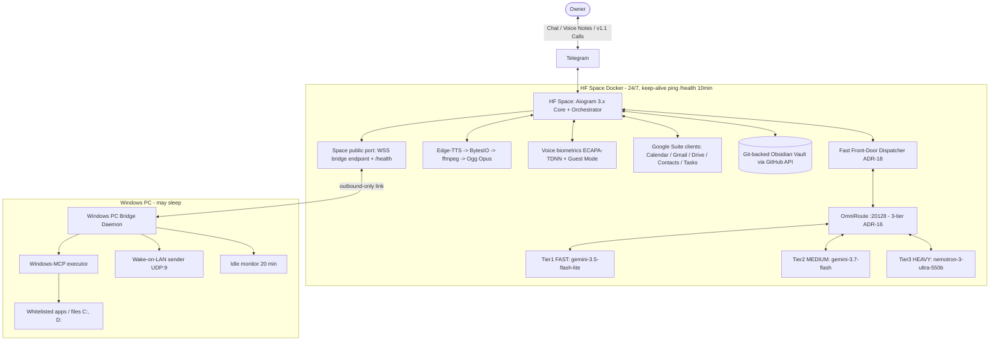

# 01 — System Architecture

## 1. Confirmed Mission Record (Discovery, 2026-08-26)

- **Project**: Vantrilex Assistant OS — Universal Agentic OS v1.1.0, persona **Sara (سارة)**.
- **Rulings**: Sara naming (Q1) · VPS-primary topology (Q2 — **superseded by ADR-15: HF
  Spaces runtime host, 2026-08-29**) · owner-only access (Q3) ·
  v1.0 = exec core minus live calls (Q4) · $0.00 absolute + Telegram confirmation fallback
  for whitelist misses (Q5) · credential manifest filled progressively (Q6).
- **OmniRoute gateway**: `http://localhost:20128/v1`, co-located with the core;
  aggregates 90+ free provider pools with quota-aware auto-fallback. Adapter:
  `src/gateway.py` (`OmniRouteClient`) — the only module speaking LLM wire format;
  SSE streaming, 3-tier model chain (ADR-16), quota/transient/fatal classification
  (mid-stream SSE error events classified, never swallowed); consumers get plain text
  deltas or `GatewayError`. The **Fast Front-Door Dispatcher** (ADR-18) answers with
  Tier 1 (<250 ms TTFT) and routes single/dual-tool work to Tier 2, multi-step DAGs to
  Tier 3.
- **Telegram voice/chat architecture**: Aiogram 3.x long-polling plain-text chat;
  **progressive delivery** (task 2.2): placeholder message instantly, first edit on the
  ack (<250 ms Audio-TTFT), deltas coalesced at `STREAM_EDIT_INTERVAL_MS` (750 ms default),
  final text verbatim; a newer owner message cancels the in-flight stream. Edge-TTS
  (`ar-JO-SanaNeural`) streamed in-memory via `io.BytesIO`, transcoded by ffmpeg to native
  Ogg Opus voice bubbles (<600 ms first-chunk target); live bidirectional calls via PyTgCalls
  arrive in v1.1.
- **Validated deployment path (ADR-15, 2026-08-29)**: free-tier **Hugging Face Spaces** hosts
  ONE Docker Space co-locating core + OmniRoute + Edge-TTS (single public port = WSS bridge
  endpoint + `/health`; HF Secrets; keep-alive cron ping every 10 min); the Space's filesystem is
  disposable — all durable state lives in the git-backed vault; **Windows PC Bridge daemon**
  connects outbound-only (TLS WebSocket, zero inbound ports) executing WoL + Windows-MCP tasks.
  PC may sleep; Sara stays up.

## 2. Component Topology



## 3. Audio Pipeline (voice notes) — `src/voice.py`

1. Response text is dialect-normalized (M1 `src/dialect.py`, from Sprint 1.4) and
   finalized by the orchestrator.
2. `VoicePipeline.synthesize_stream(text)`: Edge-TTS streams `ar-JO-SanaNeural` MP3
   chunks straight into the ffmpeg child's stdin — zero disk writes anywhere.
3. ffmpeg runs via asyncio subprocess (natively non-blocking) transcoding MP3 -> Ogg
   Opus (48 kHz mono, 20 ms frames, 24k VBR voip); tiny `-probesize 32` keeps output
   flowing from the first frames (the default probesize gates ALL output until EOF —
   measured 2026-08-29).
4. Latency metric (binding, Q1): **time-to-first-encoded-chunk** — Telegram Bot API
   cannot progressively upload one voice bubble, so the first Ogg Opus chunk is
   handed to the sender as soon as it is encoded (<600 ms target); the remainder
   follows. Caller sends via
   `await message.answer_voice(BufferedInputFile(ogg_bytes, filename="sara.ogg"))`.
5. Dialect notes (`Dialect_Notes.md`) tune pronunciation/colloquialism over time.

## 4. Tiered Email Triage Matrix

| Tier | Detection | v1.0 Action | v1.1 Action |
|---|---|---|---|
| Low / Spam | Classifier score low | Drop & ignore | Drop & ignore |
| Semi-important | Medium score | Structured Telegram Markdown text | Same |
| Important / review needed | High score | Edge-TTS voice note | Voice note |
| Critical / urgent / VIP | VIP sender or urgency keywords | Priority voice note + repeat ping until acknowledged | **Immediate PyTgCalls outbound call** |

Classifier input is untrusted data: parsed email bodies can never trigger PC actions.
Before any LLM classification the body is compacted (M7, TokenJuice pattern): signatures,
disclaimers, tracking boilerplate and quoted chains are stripped and the body is capped to
the classification budget — cutting free-pool token burn without changing tier decisions.

Refinement lane (v1.0): deterministic heuristics first; the ambiguous remainder gets
ONE `FAST_MODEL` call (temperature 0, JSON verdict `{tier, reason}`, 15 s timeout) with
the body wrapped between `<<<EMAIL_DATA>>>` / `<<<END_EMAIL_DATA>>>` markers and a
containment clause in the system prompt. The final tier is the higher-visibility of
heuristic vs model — the model can rescue upward but never downgrade or silence
(model failure/timeout/invalid JSON ⇒ heuristic verdict alone). Critical mail repeats
its ping every `CRITICAL_PING_INTERVAL_MIN` minutes until the ack button, any owner
activity, or `CRITICAL_PING_MAX` pings (`0` = unlimited) — VIP senders skip the model
entirely.

Delivery note (v1.0): Gmail `users.watch` is registered once at startup when
`GMAIL_PUBSUB_TOPIC` is set (push option kept open), but inbox delivery is POLLING —
historyId incremental with query-sweep fallback — preserving the zero-inbound-ports
posture. True Pub/Sub webhook (public HTTPS) is deferred to v1.1.

## 5. Whitelist Guardrail (PC control)

```json
{
  "allowed_apps": [
    {"name": "calculator", "executable": "calc.exe", "auto_approve": true},
    {"name": "obsidian", "executable": "Obsidian.exe", "auto_approve": true}
  ],
  "restricted_actions": [
    {"action": "shutdown", "requires_confirmation": true},
    {"action": "restart", "requires_confirmation": true},
    {"action": "sleep", "requires_confirmation": true}
  ]
}
```

Flow: request -> lookup in `config/whitelist.json` -> whitelisted => execute via
Windows-MCP and notify -> NOT whitelisted => confirmation prompt on Telegram
(v1.0 text/voice note; v1.1 live call: "هاد البرنامج مش بالقائمة المعتمدة، هل
بتأكدلي صراحة؟") => explicit approval recorded (confirmation ID persisted to vault)
=> execute. Idle >20 min => Sara offers shutdown/sleep by message.

The same bridge channel (LAN port 8000, authenticated WSS + `BRIDGE_TOKEN`) serves the
**desktop telemetry protocol**: `GET /telemetry/live-state` returns the active foreground
window, running whitelisted processes, and daily categorized screen time — consumed by
Tier 2 (ADR-16) for briefs and check-ins.

## 6. Knowledge Vault Layout (PARA + Zettelkasten)

```
01_Projects/   03_Resources/   04_Archives/
02_Areas/Profile/User_Info.md   02_Areas/Profile/Dialect_Notes.md
Contacts/
  Family/  Friends/  Colleagues/  Ignored/  Unknown/
Call_Transcripts/       Studies/       Voice_Memos/       Daily_Logs/
```

Mandatory directories (master directive 2026-08-29; `02_Areas/Studies/` migrates to top-level
`Studies/`): `Contacts/`, `Call_Transcripts/` (written from v1.1), `Studies/`, `Voice_Memos/`,
`Daily_Logs/YYYY-MM-DD.md` — a first-boot guard test asserts all exist. The vault taxonomy
itself is dynamic (M5): Sara creates new sub-directories/tag ontologies as domains emerge,
every structural change landing as an auditable git commit; the PARA backbone is
expansion-only.

Voice memos from mobile are transcribed, tagged with YAML frontmatter, and filed
automatically. Conversations that produce actionable tasks close with Sara asking:
"هل بتحب ألخص لك شو رح أعمل هسا؟" — then recites the summary and files it
(suppressed for casual check-ins). Full transcript persistence applies to calls from v1.1.

### 6b. Social Graph & Multi-Speaker Enrollment (`skill-social-graph-and-voice-enrollment`)

The vault's `Contacts/` tree is a structured social graph, each person a dossier with
relational tags, interaction log, and (when enrolled) an encrypted voiceprint vector:

| Dossier dir | Meaning |
|---|---|
| `Contacts/Family/` | Family — relational tags + voiceprint vectors |
| `Contacts/Friends/` | Social-circle profiles + interaction logs |
| `Contacts/Colleagues/` | Academic/professional peers and collaborators |
| `Contacts/Ignored/` | Blacklisted/ignored — no interaction tracking |
| `Contacts/Unknown/` | Unidentified speakers — anonymous embeddings + timestamped transcripts, security flag |

**Story entity & action extractor**: when the owner narrates their day, Sara extracts
mentioned entities, infers/updates each one's relationship category, and appends a
timestamped action summary to the person's `Contacts/{Category}/{Name}.md` AND
`Daily_Logs/YYYY-MM-DD.md`. Ambiguous category changes are confirmed with the owner first;
`Ignored/` dossiers are never tracked.

**Voiceprint lifecycle** (extends ADR-17 from owner-only to multi-speaker):
- **A — known speaker**: incoming voice matching an enrolled contact -> transcript appended
  to their dossier, embedding stability updated (running centroid). Contact-mode is
  conversational ONLY — zero privileged calls (no PC, whitelist, Gmail, private vault).
- **B — new speaker, owner present**: Sara asks verbally — «عمر، هاد أخوك أحمد؟ أعتمد
  بصمته وأضيفه للعائلة؟» — and on owner confirmation creates the dossier and stores the
  voiceprint (category per the owner's answer).
- **C — new speaker, owner absent (Guest Mode)**: message + temporary voiceprint embedding
  staged under `Voice_Memos/Pending_Speakers/`; at the owner's next interaction Sara briefs
  verbally — «اتصل شخص حكى إنه أخوك أحمد وتركلك رسالة كذا... أعتمد بصمته وأعمل له ملف؟» —
  then routes the verdict: confirmed -> `Contacts/{Category}/{Name}.md` + stored voiceprint;
  «تجاهليه» -> `Contacts/Ignored/`; «ما بعرفه» -> `Contacts/Unknown/` with a security flag.

LANDED (sprint-2 2.3b, `src/skills/social_enrollment.py`): `VoiceprintRegistry` —
`match_vector` (owner checked first, <50 ms cosine), `enroll`/`update_stability`
(Fernet-sealed vectors under `State/voiceprints/`, dossier frontmatter `voiceprint_ref`),
`stage_pending`/`pending_briefs`/`resolve_pending` (three-way verdict routing above),
`record_transcript` (timestamped dossier section). Bot wiring: `verify_or_lockdown`
routes matched contacts to `CONTACT_MODE_AR` (message-taking only) before Guest Mode.

## 7. Component Registry (`config/agents_config.json`)

```json
{
  "agent": {
    "name": "Sara (سارة)",
    "dialect": "ar-JO",
    "voice": "ar-JO-SanaNeural",
    "personality": "Warm, executive, polymath tutor, supportive friend",
    "mcp_servers": [
      "google_workspace_mcp",
      "obsidian_mcp",
      "windows_mcp"
    ]
  }
}
```

## 8. Staged Components (not in v1.0)

| Component | Release | Rationale |
|---|---|---|
| PyTgCalls live calls + post-call verbal summary protocol | v1.1 | Most fragile dependency isolated per Q4 |
| tech-hardware-scout, career-project-incubator | v1.1 | Excluded from Q4 v1.0 enumeration |
| Mem0 context engine over Firebase Firestore | v1.1 (evaluation) | Vault loop must prove out first |
| Virtual cloud SIP telephony | v1.5 | Roadmap |
| Social media agent (GitHub/LinkedIn/Instagram) | v2.0 | Roadmap |

Owner-parked **Future Scope** (no version assigned, each enters via the standard spec pipeline
when prioritized): PC Health Monitor · Voice Read-It-Later · Emotional Context Memory ·
Silent Vault Backup · on-demand YouTube/Weather/Maps API calls (per-request only, free-tier
endpoints — the $0.00 invariant is preserved; no standing subscriptions). Morning Briefing
already ships in v1.0 (Sprint-2 daily brief).

## 9. Master-Directive Capability Map (2026-08-29)

Binding spec: `docs/specs/master-directive-2026-08-29.md` (M1-M9) — adaptive Jordanian
dialect engine (Sprint 1.4) · speaker verification + Guest Mode with zero-trust lockdown
(Sprint 2.6, ADR-17; lockdown test on the sacred floor) · daily activity ledger +
randomized evening check-in (Sprint 2.7) · triage token compaction (Sprint 2.4, ADR-19) ·
mandatory vault directories + dynamic taxonomy expansion (Sprint 3.1/3.4, ADR-21) ·
dynamic capability expansion with natural-language Arabic cron (Sprint 4.2, M4) ·
syllabus PDF-to-DAG parser (Sprint 4.1, TIER3) · polymath tutor (Sprint 4.3, M9;
artifacts filed to `Studies/`) · >=85% coverage gate (Sprint 4.4a) · HF Spaces
packaging (Sprint 4.4b, ADR-15) · per-sprint skill rotation + teardown
(`.claude/skills/` wiped at sprint exit, outcomes in `docs/10-CHECKPOINT.md`) ·
VAD + barge-in on live calls (v1.1, M8). Hosting and brain-routing rulings: ADR-15 / ADR-16 / ADR-17 / ADR-18 /
ADR-19 / ADR-20 / ADR-21 in `docs/03-DECISIONS.md`.
