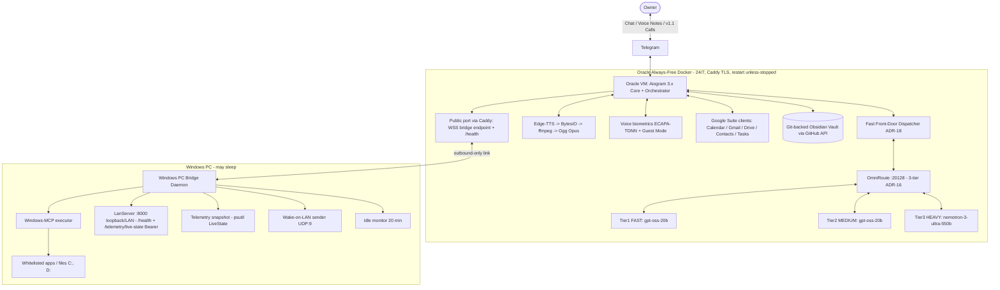

# 01 — System Architecture

## 1. Confirmed Mission Record (Discovery, 2026-08-26)

- **Project**: Vantrilex Assistant OS — Universal Agentic OS v1.1.0, persona **Sara (سارة)**.
- **Rulings**: Sara naming (Q1) · VPS-primary topology (Q2 — **superseded by ADR-15: HF
  Spaces runtime host, 2026-08-29**) · owner-only access (Q3) ·
  v1.0 = exec core minus live calls (Q4) · $0.00 absolute + Telegram confirmation fallback
  for whitelist misses (Q5) · credential manifest filled progressively (Q6).
- **OmniRoute gateway**: `http://localhost:20128/v1`, co-located with the core;
  aggregates 90+ free provider pools with quota-aware auto-fallback. Adapter:
  `src/gateway.py` (`OmniRouteClient`) — the only module speaking LLM wire format;
  SSE streaming, 3-tier model chain (ADR-16), quota/transient/fatal classification
  (mid-stream SSE error events classified, never swallowed); consumers get plain text
  deltas or `GatewayError`. The **Fast Front-Door Dispatcher** (ADR-18) answers with
  Tier 1 (<250 ms TTFT) and routes single/dual-tool work to Tier 2, multi-step DAGs to
  Tier 3.
- **Telegram voice/chat architecture**: Aiogram 3.x long-polling plain-text chat;
  **progressive delivery** (task 2.2): placeholder message instantly, first edit on the
  ack (<250 ms Audio-TTFT), deltas coalesced at `STREAM_EDIT_INTERVAL_MS` (750 ms default),
  final text verbatim; a newer owner message cancels the in-flight stream. Edge-TTS
  (`ar-JO-SanaNeural`) streamed in-memory via `io.BytesIO`, transcoded by ffmpeg to native
  Ogg Opus voice bubbles (<600 ms first-chunk target); live bidirectional calls via PyTgCalls
  arrive in v1.1.
- **Validated deployment path (ADR-15 as amended 2026-08-31)**: **Oracle Cloud Always-Free
  VM** hosts ONE Docker container co-locating core + OmniRoute + Edge-TTS (single public
  port behind Caddy TLS = WSS bridge endpoint + `/health`; environment file on the VM;
  `restart: unless-stopped` — the VM never sleeps, the keep-alive cron is an optional
  liveness alarm); the disposable-filesystem rule stays as a design principle — all durable
  state lives in the git-backed vault; **Windows PC Bridge daemon**
  connects outbound-only (TLS WebSocket, zero inbound ports) executing WoL + Windows-MCP tasks.
  PC may sleep; Sara stays up. (Amendment history: HF Space chosen 2026-08-29 — HF made
  Docker Spaces paid $9/mo, discovered at deploy time 2026-08-31; owner ruled Oracle.)

## 2. Component Topology



## 3. Audio Pipeline (voice notes) — `src/voice.py`

1. Response text is dialect-normalized (M1 `src/dialect.py`, from Sprint 1.4) and
   finalized by the orchestrator.
2. `VoicePipeline.synthesize_stream(text)`: Edge-TTS streams `ar-JO-SanaNeural` MP3
   chunks straight into the ffmpeg child's stdin — zero disk writes anywhere.
3. ffmpeg runs via asyncio subprocess (natively non-blocking) transcoding MP3 -> Ogg
   Opus (48 kHz mono, 20 ms frames, 24k VBR voip); tiny `-probesize 32` keeps output
   flowing from the first frames (the default probesize gates ALL output until EOF —
   measured 2026-08-29).
4. Latency metric (binding, Q1): **time-to-first-encoded-chunk** — Telegram Bot API
   cannot progressively upload one voice bubble, so the first Ogg Opus chunk is
   handed to the sender as soon as it is encoded (<600 ms target); the remainder
   follows. Caller sends via
   `await message.answer_voice(BufferedInputFile(ogg_bytes, filename="sara.ogg"))`.
5. Dialect notes (`Dialect_Notes.md`) tune pronunciation/colloquialism over time.

## 4. Tiered Email Triage Matrix

| Tier | Detection | v1.0 Action | v1.1 Action |
|---|---|---|---|
| Low / Spam | Classifier score low | Drop & ignore | Drop & ignore |
| Semi-important | Medium score | Structured Telegram Markdown text | Same |
| Important / review needed | High score | Edge-TTS voice note | Voice note |
| Critical / urgent / VIP | VIP sender or urgency keywords | Priority voice note + repeat ping until acknowledged | **Immediate PyTgCalls outbound call** |

Classifier input is untrusted data: parsed email bodies can never trigger PC actions.
Before any LLM classification the body is compacted (M7, TokenJuice pattern): signatures,
disclaimers, tracking boilerplate and quoted chains are stripped and the body is capped to
the classification budget — cutting free-pool token burn without changing tier decisions.

Refinement lane (v1.0): deterministic heuristics first; the ambiguous remainder gets
ONE `FAST_MODEL` call (temperature 0, JSON verdict `{tier, reason}`, 15 s timeout) with
the body wrapped between `<<<EMAIL_DATA>>>` / `<<<END_EMAIL_DATA>>>` markers and a
containment clause in the system prompt. The final tier is the higher-visibility of
heuristic vs model — the model can rescue upward but never downgrade or silence
(model failure/timeout/invalid JSON ⇒ heuristic verdict alone). Critical mail repeats
its ping every `CRITICAL_PING_INTERVAL_MIN` minutes until the ack button, any owner
activity, or `CRITICAL_PING_MAX` pings (`0` = unlimited) — VIP senders skip the model
entirely.

Delivery note (v1.0): Gmail `users.watch` is registered once at startup when
`GMAIL_PUBSUB_TOPIC` is set (push option kept open), but inbox delivery is POLLING —
historyId incremental with query-sweep fallback — preserving the zero-inbound-ports
posture. True Pub/Sub webhook (public HTTPS) is deferred to v1.1.

## 5. Whitelist Guardrail (PC control)

```json
{
  "allowed_apps": [
    {"name": "calculator", "executable": "calc.exe", "auto_approve": true},
    {"name": "obsidian", "executable": "Obsidian.exe", "auto_approve": true}
  ],
  "restricted_actions": [
    {"action": "shutdown", "requires_confirmation": true},
    {"action": "restart", "requires_confirmation": true},
    {"action": "sleep", "requires_confirmation": true}
  ]
}
```

Flow (realized in sprint-3 3.4, `bridge/` + `src/pc_actions.py`): the daemon dials OUT to
the core's WSS endpoint (zero inbound PC ports) and is the only process on the PC that
executes commands — the guard re-checks `config/whitelist.json` on EVERY check (owner
edits apply live; a corrupt file fails CLOSED, confirming everything, with a CRITICAL
log). request -> lookup -> whitelisted (`auto_approve`) => execute and notify ->
NOT whitelisted => confirmation prompt on Telegram (v1.0 text/voice note; v1.1 live call:
"هاد البرنامج مش بالقائمة المعتمدة، هل بتأكدلي صراحة؟") => explicit approval => the core
mints a `confirmation_id` + audit code (`PC-YYYYMMDD-HHMMSS-4hex`), persists the
Confirmations note BEFORE the command leaves (approval without audit is void), then
re-sends WITH the id => execute. One audit code chains note -> command -> ExecResult ->
the owner-quotable «رمز التدقيق». Every event lands one line in
`04_Archives/Audit/pc-ledger.md`. Power actions ALWAYS need a confirmation id regardless
of any whitelist flag. Idle >20 min => Sara offers sleep/shutdown once per idle window
(real activity re-arms); the owner's choice rides the same confirmation flow.

The same bridge channel (LAN port 8000, token-authenticated, loopback/LAN-bound — never
0.0.0.0) serves the **desktop telemetry protocol** (sprint-3 3.5): one psutil snapshot
(`bridge/telemetry.live_state()`) — cpu, ram, C:/D: disks, uptime, top-CPU process —
degrades unmeasurable metrics to None instead of crashing, and reaches Sara two ways:
`GET /telemetry/live-state` (Bearer BRIDGE_TOKEN) for direct LAN diagnostics, and the
tunnel cmd `telemetry.state` for the core-side `TelemetryClient`, which narrates ONE
Jordanian line at Tier 1 FAST («شو وضع الجهاز؟») — numbers verbatim from the state,
deterministic numeric fallback when the brain is unreachable, honest
«الجسر مو متصل هسا» when the bridge is offline. Payload carries no secrets (no token,
no hostname, no paths). Wire contract: `docs/06-API-SPECIFICATION.md`.

## 6. Knowledge Vault Layout (PARA + Zettelkasten)

```
01_Projects/   03_Resources/   04_Archives/
02_Areas/Profile/User_Info.md   02_Areas/Profile/Dialect_Notes.md
Contacts/
  Family/  Friends/  Colleagues/  Ignored/  Unknown/
Call_Transcripts/       Studies/       Voice_Memos/       Daily_Logs/
```

Mandatory directories (master directive 2026-08-29; `02_Areas/Studies/` migrates to top-level
`Studies/`): `Contacts/`, `Call_Transcripts/` (written from v1.1), `Studies/`, `Voice_Memos/`,
`Daily_Logs/YYYY-MM-DD.md` — a first-boot guard test asserts all exist. The vault taxonomy
itself is dynamic (M5): Sara creates new sub-directories/tag ontologies as domains emerge,
every structural change landing as an auditable git commit; the PARA backbone is
expansion-only.

Vault transport (sprint-3 3.1, `src/vault.py`): `VaultClient` speaks the GitHub Contents API
directly (`api.github.com`, `Bearer VAULT_GITHUB_TOKEN` + versioned headers, `?ref=VAULT_BRANCH`)
— chosen over a local clone because the core's container filesystem is disposable by
design (ADR-15 principle, kept on the Oracle VM) and owner-only write volume makes
per-write commits cheap. `upsert` reads the sha
first (404 -> create, 200 -> sha update), retries one 409 via GET->PUT then raises
`VaultConflictError`; auth errors propagate loudly with zero retries. Structural changes (the
Studies migration, 3.2 expansion) land as ONE commit through the Git Data API (`commit_files`:
blobs -> tree -> commit -> ref). Payloads above 1,000,000 bytes are refused pre-flight
(defensive content bound, not an API limit). Note titles pass ONE deterministic sanitizer
(separators -> spaces, forbidden chars stripped, Arabic preserved:
«ملاحظة: اجتماع/الأسبوع؟» -> «ملاحظة اجتماع الأسبوع»). Frontmatter is
`yaml.safe_dump(allow_unicode=True, sort_keys=False)` inside leading `---` fences only;
malformed YAML on read raises ValueError naming the path. Canonical constants consumed by
3.3/3.4: `PROFILE_USER_INFO`, `PROFILE_DIALECT`, `CONVERSATIONS_DIR`,
`CONFIRMATIONS_DIR`, `AUDIT_DIR` (all under `04_Archives/`). The token never reaches a log,
exception, or URL (`redact_secret` screens every such path). First boot:
`ensure_mandatory_dirs()` upserts an index note per missing mandatory dir and contacts
subdir plus both profile files — idempotent, re-run writes nothing.

Dynamic taxonomy expansion (sprint-3 3.2, `src/vault_expand.py`): `VaultExpander.expand(domain, dirs, tags)`
grows new domain trees under `01_Projects/<domain>` as structure emerges in conversation — a
sanitized sub-directory per relative `dirs` entry, an `_index.md` per directory (frontmatter
`type: vault-index`, body wikilinking the domain root), and the tag ontology at
`<domain>/_tags.yaml` (safe_dump: `domain:`, `created:` ISO-UTC, `tags:` list, Arabic intact).
The whole expansion lands as ONE auditable commit (`sara: expand vault — <domain>`) via the Git
Data API. The PARA backbone is expansion-only:

```
01_Projects/  02_Areas/  03_Resources/  04_Archives/
Contacts/  Call_Transcripts/  Studies/  Voice_Memos/  Daily_Logs/
```

any request whose domain touches one of those names raises `BackboneImmutableError` pre-flight
(zero API calls), and the module has no delete/move code path at all. Idempotent: existence is
read from the vault on every call (vault state IS the memory — no local cache), existing
dirs/notes are left untouched, and the result reports only the delta (re-run = empty delta, no
commit). LLM-proposed structure is DATA — the orchestrator validates proposals through this
typed interface only; invalid proposals (empty domain, nothing to create, residual separators)
are refused pre-flight with owner-readable reasons. The owner reviews every structural change
through the vault repo's git history.

Voice memos from mobile are transcribed, tagged with YAML frontmatter, and filed
automatically. Conversations that produce actionable tasks close with Sara asking:
"هل بتحب ألخص لك شو رح أعمل هسا؟" — then recites the summary and files it
(suppressed for casual check-ins). Full transcript persistence applies to calls from v1.1.

Verbal action summary protocol (sprint-3 3.3, `src/summary.py` + `common/consent.py`):
`TaskExtractor.extract` rides ONE TIER 2 MEDIUM call per turn (ADR-16 — the tool-executor
tier); the reply is strict JSON validated into `ActionTask` models — LLM output is DATA,
garbage/injection-shaped replies collapse to `[]` loudly (logged by SHA-256 hash, never
content). A turn with tasks mints ONE `PendingSummary` and sends the exact prompt string
«هل بتحب ألخص لك شو رح أعمل هسا؟»; a newer turn supersedes an unanswered older pending;
casual turns capture nothing (zero vault writes). Consent grammar is shared with 3.4 via
`common/consent.py` (`AFFIRMATIVES`, `is_affirmative` — first-token Jordanian affirmative
match; ambiguous replies are declines, never guessed as consent), and the binding rule is
structural: the affirmative mints consent only when it FOLLOWS the live prompt — a stale
or foreign pending id is inert. On «ايه/نعم/تمام…» the summary files as
`04_Archives/Conversations/YYYY-MM-DD-HHMMSS-summary.md` — frontmatter `id`, `asked_at`,
`resolved_at`, `task_count`, `tags: [action-summary]`; numbered tasks (due dates inline) +
a Zettelkasten wikilink to that day's daily log. Arbitration (safety > convenience): when
a 3.4 pending confirmation is also active, the confirmation consumer owns the next owner
message; the summary question is re-asked ONCE after the confirmation resolves
(deterministic, tested). Brain failure leaves the turn uncaptured (learning loss
acceptable, breakage not); a failed vault filing retains the pending for one retry then
drops loudly; in-memory pendings are lost on restart — accepted ceiling (ponytail note in
code documents the vault-scratch-note upgrade path).

Voice-to-vault leg (sprint-2 2.5, `src/skills/voice_to_vault_transcriber.py`): after the
2.3 biometric gate passes, the owner's voice note decodes in-memory (ffmpeg, 16 kHz mono
s16le) and transcribes via LOCAL faster-whisper (MIT, CPU `int8` — cloud STT settled to
never, ADR-22) on a dedicated executor, then files `Voice_Memos/YYYY-MM-DD-HHMM.md`
atomically (YAML frontmatter: `date` (+03:00), `source`, `duration_s`; same-minute
memos get numeric suffixes). The transcript then enters the standard owner-text
pipeline — tier selection is the ADR-18 dispatcher's decision, never this module's.

Evening journaler (sprint-2 2.6, `src/skills/evening_journaler.py`): once per local day,
at a `random.uniform` slot inside `[JOURNALER_WINDOW_START, JOURNALER_WINDOW_END)`
(Amman), Sara sends ONE short Jordanian check-in (tasks done, critical mail, memos filed
+ one open question) and writes the ledger `Daily_Logs/YYYY-MM-DD.md` — YAML frontmatter
(`date`, `checkin_sent`) with Calendar / Mail / Voice memos / Notes sections, each
degrading independently to «غير متوفر حالياً». Calendar-booked owners get no message but
still get the ledger; send failures retry the next 30 s tick without persisting the
check-in date; a state-loss same-day re-run appends a corrigenda line instead of
duplicating. Zero LLM in the hot path, stdlib `zoneinfo` + `asyncio.sleep` scheduling.

### 6b. Social Graph & Multi-Speaker Enrollment (`skill-social-graph-and-voice-enrollment`)

The vault's `Contacts/` tree is a structured social graph, each person a dossier with
relational tags, interaction log, and (when enrolled) an encrypted voiceprint vector:

| Dossier dir | Meaning |
|---|---|
| `Contacts/Family/` | Family — relational tags + voiceprint vectors |
| `Contacts/Friends/` | Social-circle profiles + interaction logs |
| `Contacts/Colleagues/` | Academic/professional peers and collaborators |
| `Contacts/Ignored/` | Blacklisted/ignored — no interaction tracking |
| `Contacts/Unknown/` | Unidentified speakers — anonymous embeddings + timestamped transcripts, security flag |

**Story entity & action extractor**: when the owner narrates their day, Sara extracts
mentioned entities, infers/updates each one's relationship category, and appends a
timestamped action summary to the person's `Contacts/{Category}/{Name}.md` AND
`Daily_Logs/YYYY-MM-DD.md`. Ambiguous category changes are confirmed with the owner first;
`Ignored/` dossiers are never tracked.

**Voiceprint lifecycle** (extends ADR-17 from owner-only to multi-speaker):
- **A — known speaker**: incoming voice matching an enrolled contact -> transcript appended
  to their dossier, embedding stability updated (running centroid). Contact-mode is
  conversational ONLY — zero privileged calls (no PC, whitelist, Gmail, private vault).
- **B — new speaker, owner present**: Sara asks verbally — «عمر، هاد أخوك أحمد؟ أعتمد
  بصمته وأضيفه للعائلة؟» — and on owner confirmation creates the dossier and stores the
  voiceprint (category per the owner's answer).
- **C — new speaker, owner absent (Guest Mode)**: message + temporary voiceprint embedding
  staged under `Voice_Memos/Pending_Speakers/`; at the owner's next interaction Sara briefs
  verbally — «اتصل شخص حكى إنه أخوك أحمد وتركلك رسالة كذا... أعتمد بصمته وأعمل له ملف؟» —
  then routes the verdict: confirmed -> `Contacts/{Category}/{Name}.md` + stored voiceprint;
  «تجاهليه» -> `Contacts/Ignored/`; «ما بعرفه» -> `Contacts/Unknown/` with a security flag.

LANDED (sprint-2 2.3b, `src/skills/social_enrollment.py`): `VoiceprintRegistry` —
`match_vector` (owner checked first, <50 ms cosine), `enroll`/`update_stability`
(Fernet-sealed vectors under `State/voiceprints/`, dossier frontmatter `voiceprint_ref`),
`stage_pending`/`pending_briefs`/`resolve_pending` (three-way verdict routing above),
`record_transcript` (timestamped dossier section). Bot wiring: `verify_or_lockdown`
routes matched contacts to `CONTACT_MODE_AR` (message-taking only) before Guest Mode.

VAULT-SIDE (sprint-3 3.1b, `src/skills/social_graph.py`): `SocialGraph` rides
`VaultClient` — `dossier()`/`create_dossier()` (frontmatter
`name/category/relation_tags/voiceprint_ref/created/last_interaction`; `Ignored/`
carries `tracking: false`, `Unknown/` carries `security_flag: true`), `extract_entities()`
(ONE FAST-tier call per narration; strict-JSON reply validated into `EntityMention`
models — LLM output is DATA, garbage -> [] loudly), and `file_action()` (dated
`## YYYY-MM-DD` section appended to the person's dossier AND `Daily_Logs/YYYY-MM-DD.md`;
ambiguous `category_inferred: null` holds for owner confirmation before filing;
`Ignored/` mentions never write).

## 7. Component Registry (`config/agents_config.json`)

```json
{
  "agent": {
    "name": "Sara (سارة)",
    "dialect": "ar-JO",
    "voice": "ar-JO-SanaNeural",
    "personality": "Warm, executive, polymath tutor, supportive friend",
    "mcp_servers": [
      "google_workspace_mcp",
      "obsidian_mcp",
      "windows_mcp"
    ]
  }
}
```

## 8. Staged Components (not in v1.0)

| Component | Release | Rationale |
|---|---|---|
| PyTgCalls live calls + post-call verbal summary protocol | v1.1 | Most fragile dependency isolated per Q4 |
| tech-hardware-scout, career-project-incubator | v1.1 | Excluded from Q4 v1.0 enumeration |
| Mem0 context engine over Firebase Firestore | v1.1 (evaluation) | Vault loop must prove out first |
| Virtual cloud SIP telephony | v1.5 | Roadmap |
| Social media agent (GitHub/LinkedIn/Instagram) | v2.0 | Roadmap |

Owner-parked **Future Scope** (no version assigned, each enters via the standard spec pipeline
when prioritized): PC Health Monitor · Voice Read-It-Later · Emotional Context Memory ·
Silent Vault Backup · on-demand YouTube/Weather/Maps API calls (per-request only, free-tier
endpoints — the $0.00 invariant is preserved; no standing subscriptions). Morning Briefing
already ships in v1.0 (Sprint-2 daily brief).

## 9. Master-Directive Capability Map (2026-08-29)

Binding spec: `docs/specs/master-directive-2026-08-29.md` (M1-M9) — adaptive Jordanian
dialect engine (Sprint 1.4) · speaker verification + Guest Mode with zero-trust lockdown
(Sprint 2.6, ADR-17; lockdown test on the sacred floor) · daily activity ledger +
randomized evening check-in (Sprint 2.7) · triage token compaction (Sprint 2.4, ADR-19) ·
mandatory vault directories + dynamic taxonomy expansion (Sprint 3.1/3.4, ADR-21) ·
dynamic capability expansion with natural-language Arabic cron (Sprint 4.2, M4) ·
syllabus PDF-to-DAG parser (Sprint 4.1, TIER3) · polymath tutor (Sprint 4.3, M9;
artifacts filed to `Studies/`) · >=85% coverage gate (Sprint 4.4a) · ONE-container
packaging (Sprint 4.4b, ADR-15; host amended to Oracle 2026-08-31) · per-sprint skill rotation + teardown
(`.claude/skills/` wiped at sprint exit, outcomes in `docs/10-CHECKPOINT.md`) ·
VAD + barge-in on live calls (v1.1, M8). Hosting and brain-routing rulings: ADR-15 / ADR-16 / ADR-17 / ADR-18 /
ADR-19 / ADR-20 / ADR-21 in `docs/03-DECISIONS.md`.
